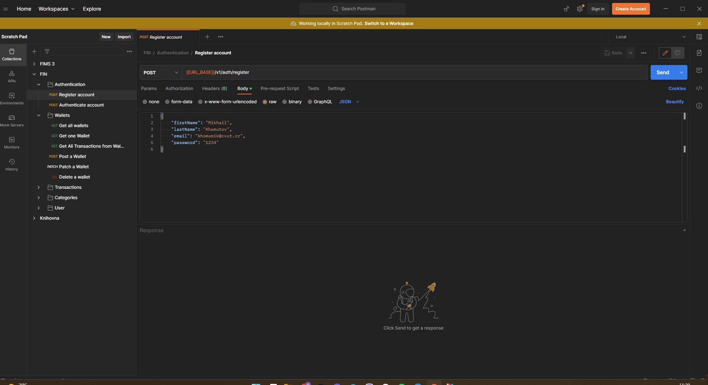

# FIN

Short description or introduction to the project.

Hello there, newComers. This project is modified bachelor thesis. 
Main application is 2 years old, so do not look very precisely. 

Main idea is to show one of my features I worked on: 
Dynamic filtering via Spring Specification and Hibernate Criteria. 
Main class is [CustomSpecification.java](src/main/java/com/example/fin/filtering/CustomSpecification.java) 
and all the magic is around [filtering](src/main/java/com/example/fin/filtering)
package.


## Table of Contents

- [Project Description](#project-description)
- [Main Features](#main-features)
- [Getting Started](#getting-started)
- [Prerequisites](#prerequisites)
- [Installation](#installation)
- [Testing](#testing)
- [Adminer](#adminer)
- [Postman](#postman)
- [Configuration](#configuration)

## Project Description

This is a Bachelor Thesis project named FIN (FINances).

## Main features

- Security for individual users using JWT (JsonWebToken)
- Simple using of REST API
- Scalable Application
- Technologies with likely continued support from developers
- Sorting Wallets by id, name, deposit, and timePeriod (ASC and DESC)
- Sorting Transactions by id, note and amount (ASC and DESC)
- Sorting Transaction Categories by id and name (ASC and DESC)
- Ability to view income or outcome for categories and wallets, separately
- Postman collection, full of possible queries to explore the API
- Simple managing of database by Adminer

## Getting Started

### Prerequisites

Make sure you have the following prerequisites installed:

- Java Development Kit openjdk-18.0.2.1
- Java version 17+
- Gradle build tool version 7.6.1
- Spring Boot version 3.0.6
- Project Lombok
- Mapstruct version 1.5.3.Final
- JWT (jsonwebtoken)
- MySql connector
- Hibernate Validator version 8.0.0.Final

### Installation

1. Create a project from Version Control in Intellij

   
    ```
   https://gitlab.fel.cvut.cz/khomumik/fin_backend.git
2. For next steps yon need to download Docker on you PC to run the application
   https://www.docker.com/products/docker-desktop/
3. Open docker and run "docker-compose up" in [docker-compose.yml](docker-compose.yml) by clicking on green services button as on the picture

   
4. Build the project using Gradle [build.gradle](build.gradle):

   

   ````
   gradle build
5. Make sure your run configuration is okay and run it

   
6. The application should now be accessible at http://localhost:8080/api/v1/ but I highly recommend to use Postman for your needs because you have postman collection prepared in [postman](postman) directory

### Testing

1. Create a new configuration for your project as on the picture

   
2. Run the configuration and explore integration testing in FIN

## Adminer

When you have installed the project and successfully run it you can explore the application database with Adminer. Adminer is very simple database manager.

Steps to get in Adminer.
1. Assume, you are successfully running the application.
2. Open this browser link (configured in [docker-compose.yml](docker-compose.yml))
   ````
   http://localhost:4200
3. Complete the form as on picture. Password for database is `fin`

   
4. Now you are in the database your application is using, so you can explore and use it for your purposes

## Postman

When you have installed the project and successfully run it you can check the features of application by postman.
Steps for postman testing:
1. Open Postman and import the
   [FIN.postman_collection.json](postman/FIN.postman_collection.json)
2. Set Local environment variable `URL_BASE`

   
3. As first, you have to register new account for application

   
4. When your account will be registered you will get `token`. Copy it

   
5. Open Fin directory setting -> Authorization: Choose Type: Bearer Token and fill `token` field with your token

   
6. Now you are authenticated, and you have access to FIN REST API. Enjoy your exploring

## Configuration

Open the application.properties file located in [application.properties](src/main/resources/application.properties).
Configure any necessary settings, such as database connection details.
